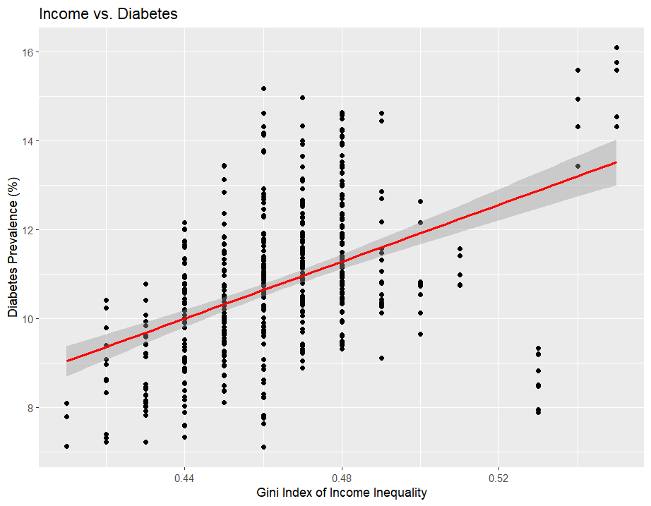

# U.S. Chronic Disease Indicators: Smoking, Socioeconomic Status & Health Outcomes

A cross-tool analysis (SQL, Python, R) of the CDC's U.S. Chronic Disease Indicators dataset. I built it to answer three specific questions about how smoking, income/education, and health insurance coverage relate to chronic disease burden across U.S. states and demographic groups.

## Business Problem

Chronic diseases (heart disease, diabetes, asthma, cancer) drive most U.S. healthcare costs and preventable deaths, but the risk isn't spread evenly. It tracks smoking behavior, income, education, and insurance access differently depending on the state and demographic group. Public health agencies need a state- and demographic-level view of where those risk factors concentrate so they can prioritize funding and interventions, instead of applying the same policy uniformly across a population that doesn't look the same everywhere.

## Objectives

- Test whether state-level smoking rates track with heart disease and lung cancer rates, and whether that relationship holds across demographic groups.
- Test whether socioeconomic status (income inequality, education) predicts diabetes and obesity prevalence.
- Test whether health insurance coverage rates relate to chronic disease management outcomes (asthma, heart disease).
- Deliver the analysis using three different tools (SQL for relational querying, R for statistical visualization, Python for exploratory pattern-finding) to show I can work across platforms, not just one.

## Dataset

| | |
|---|---|
| Source | CDC U.S. Chronic Disease Indicators (CDI), via data.cdc.gov / catalog.data.gov |
| Structure | 34 columns: year, state (`LocationAbbr`/`LocationDesc`), `Topic`/`Question` (indicator), `DataValueAlt` (numeric value), confidence limits, and up to 3 demographic stratification levels (gender, race/ethnicity, age, overall) |
| Coverage | All 50 states plus DC, multiple years, dozens of chronic-disease topics (tobacco, diabetes, cardiovascular disease, asthma, cancer, nutrition/weight, health status) |
| Storage | Loaded into an AWS S3-backed workspace for the SQL/Python part of the original analysis |

Full schema notes in [`documentation/schema_notes.md`](documentation/schema_notes.md). The raw file isn't committed (see [`data/raw/README.md`](data/raw/README.md) for the download link).

## Methodology

1. **Data cleaning** (`scripts/01_clean_data.py`): cast `DataValueAlt` to numeric, dropped unparseable rows, excluded national/territory aggregates (`US`, `GU`, `PR`, `VI`) to keep comparisons state-level, and filled missing stratification labels with `"Overall"`.
2. **SQL analysis** (`sql/`): joined smoking-rate records against cardiovascular-disease and cancer records by state, year, and demographic group (`02_smoking_vs_disease.sql`), and joined insurance-coverage records against asthma/heart-disease records the same way (`03_insurance_vs_disease_management.sql`).
3. **R analysis** (`scripts/03_r_analysis.R`): Gini index of income inequality vs. diabetes prevalence, education level vs. obesity prevalence, and the multi-year trend of obesity and diabetes prevalence together, all visualized with ggplot2.
4. **Python analysis** (`scripts/02_python_eda.py`): health insurance coverage vs. obesity prevalence (scatter plus regression line) and a regional coverage comparison.

## A Correction Worth Calling Out

The original version of this analysis had a chart labeled "Average Healthcare Coverage / Obesity **by Region**" that actually plotted five individual states (Alabama, Alaska, Arizona, Arkansas, California, just the first five alphabetically), not real geographic regions. I didn't include that chart in this repo. `scripts/02_python_eda.py` replaces it with an actual Census Bureau region grouping (Northeast, Midwest, South, West) so the "by region" label is accurate. I'm flagging this instead of quietly fixing it because catching your own mislabeled chart is exactly the kind of QA habit worth showing.

## Key Findings

*(As reported in the original analysis. The SQL/Python/R code in this repo reproduces the methodology end to end, so re-running it against a fresh CDI download will regenerate and verify these numbers directly.)*

| Question | Finding |
|---|---|
| Smoking vs. disease | Smoking prevalence tracks with heart disease and lung cancer incidence, but the relationship varies by age, gender, and socioeconomic status rather than holding at a flat rate across all groups |
| Income inequality vs. diabetes | States with a higher Gini index (more income inequality) show higher diabetes prevalence |
| Education vs. obesity | Higher high-school completion rates are associated with lower obesity prevalence |
| Obesity & diabetes over time | Both conditions show a steady upward trend over the years covered, tracking each other |
| State variation | Obesity and diabetes prevalence both vary meaningfully by state, with a subset of states consistently above the national pattern |
| Insurance coverage vs. obesity | Higher insurance coverage correlates with slightly lower obesity prevalence. It's a real relationship, but modest, not a strong driver on its own |

## Business Recommendations

- Target smoking-cessation funding at the specific demographic groups (not just states) showing the highest joint smoking and disease rates, instead of applying state-wide programs uniformly.
- Pair obesity/diabetes prevention programs with the states that show both high income inequality and low education completion. It's the co-occurrence, not either factor alone, that concentrates the risk.
- Treat insurance-coverage expansion as one lever among several for obesity outcomes, not a standalone fix. The correlation is real but not strong enough to carry the whole strategy.


*States with higher income inequality (Gini index) show higher diabetes prevalence.*

## Visualizations

Native chart exports in [`visualizations/`](visualizations/):

| File | Chart |
|---|---|
| `01_income_vs_diabetes.png` | Gini index (income inequality) vs. diabetes prevalence |
| `02_obesity_diabetes_trends_over_time.png` | Obesity & diabetes prevalence trend over time |
| `03_education_vs_obesity.png` | High school completion vs. obesity prevalence |
| `04_obesity_distribution.png` | Distribution of obesity prevalence across states |
| `05_diabetes_distribution.png` | Distribution of diabetes prevalence across states |
| `06_diabetes_rates_by_state.png` | Diabetes rate variability by state |
| `07_obesity_rates_by_state.png` | Obesity rate variability by state |
| `08_coverage_vs_obesity.png` | Insurance coverage vs. obesity prevalence |
| `09_coverage_and_obesity_trends.png` | Coverage & obesity trends over time |

*(Suggested: once you re-run `scripts/02_python_eda.py` against the real data, drop the corrected regional-coverage chart in here too, and add 1-2 AWS S3 screenshots from `documentation/screenshots/` if you want to show the cloud-hosted pipeline visually.)*

## Technologies Used

SQL (joins, CTEs, aggregation), Python (pandas, matplotlib, seaborn), R (tidyverse, ggplot2), AWS S3.

## Repository Structure

```
chronic-disease-indicators-analysis/
├── README.md
├── data/
│   ├── raw/            # download instructions (file not committed)
│   └── cleaned/         # populated by scripts/01_clean_data.py once raw data is added
├── sql/
│   ├── 01_create_table.sql
│   ├── 02_smoking_vs_disease.sql
│   └── 03_insurance_vs_disease_management.sql
├── scripts/
│   ├── 01_clean_data.py
│   ├── 02_python_eda.py
│   └── 03_r_analysis.R
├── visualizations/
└── documentation/
    ├── schema_notes.md
    └── screenshots/
```

## How to Run

```bash
git clone <repo-url>
cd chronic-disease-indicators-analysis

# 1. Download the CDI CSV into data/raw/ (see data/raw/README.md)
python scripts/01_clean_data.py

# 2. SQL: load data/cleaned/cdi_cleaned.csv into any relational DB using sql/01_create_table.sql,
#    then run sql/02_smoking_vs_disease.sql and sql/03_insurance_vs_disease_management.sql

# 3. Python EDA
pip install pandas matplotlib seaborn
python scripts/02_python_eda.py

# 4. R analysis
Rscript scripts/03_r_analysis.R
```

## Future Improvements

- Replace the state-level Gini index proxy with a direct income/education dataset join for a cleaner socioeconomic measure.
- Add confidence-interval bands to the state comparison charts using the CDI's built-in `LowConfidenceLimit`/`HighConfidenceLimit` fields. They're already in the schema and currently unused.
- Extend the insurance-coverage analysis to a proper regression controlling for state population and urbanization, instead of a single bivariate scatter.

## Challenges & How They Were Solved

- **The `DataValue` field is text, not numeric** (it carries footnote symbols). I resolved this by using `DataValueAlt`, the CDI's parallel numeric column, throughout.
- **A chart mislabeled 5 individual states as "regions"** made it into the original report. I caught it during review and rebuilt it using an actual Census Bureau region mapping (see the correction section above).
- **Comparing across topics needed a consistent join key.** I solved this by joining on `LocationAbbr` plus `YearStart` plus stratification group instead of assuming the rows would line up between topic subsets.

## Limitations

- CDI values are self-reported/survey-based (like BRFSS) at the state level, not individual-level microdata, so these findings describe state-level association, not individual causation.
- The socioeconomic analysis uses state-level aggregates (ecological data), which carries some risk of the ecological fallacy: a relationship true at the state level doesn't automatically hold for individuals within that state.
- Several `Topic`/`Question` combinations change definition slightly across years. The queries here don't try to harmonize question wording changes over time.

---
*Originally developed as an individual research project (AIT 580, George Mason University). This repository restructures the analysis into runnable SQL/Python/R code and fixes the region-labeling issue described above.*
